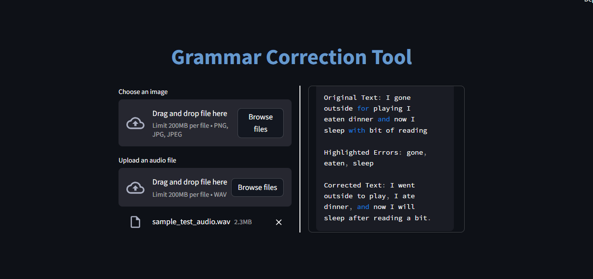

# communication-app-openai

This is an application which helps non-native english speakers to improve their communication.

The application currently supports the following user inputs:

1. Audio format
2. Image format

The user can record their voice and upload the file and the application will highlight the grammatical errors and show the corrected sentence.

Similarly with Image format.

# Run locally

Clone the repository

# Install dependencies

pip install -r requirements.txt

# Run the application

streamlit run main.py

# Output

